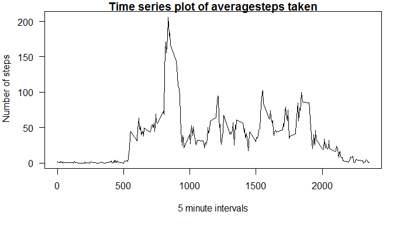

# Reproducible Research: Peer Assessment 1


## Loading and preprocessing the data


```r
activity <- read.csv("./activity/activity.csv",stringsAsFactors = FALSE)
activity$date <- as.Date(activity$date,format = "%Y-%m-%d")
```


## What is mean total number of steps taken per day?

Creating Histogram for total steps taken per day


```r
steps <- tapply(activity$steps,as.factor(activity$date),sum,na.rm=TRUE)
hist(steps,main = "Histogram of Steps taken per day",xlab= "Number of Steps")
```

<!-- -->
 
Calculating the mean and the median 


```r
meansteps <- round(mean(steps),0)
mediansteps <- median(steps)
```
**The mean number of steps per day is 9354. The median value is 10395**

## What is the average daily activity pattern?

```r
par(mar= c(5,4,1,1),las=1)
meanintsteps <- tapply(activity$steps,activity$interval,mean,na.rm=TRUE)
plot(x= names(meanintsteps),y= meanintsteps,type="l",main= "Time series plot of averagesteps taken", xlab= "5 minute intervals",ylab = " Number of steps")
```

<!-- -->

 Which 5-minute interval, on average across all the days in the dataset, contains the maximum number of steps.

```r
meanintsteps <- tapply(activity$steps,activity$interval,mean,na.rm=TRUE)
maxsteps <- names(which(meanintsteps==max(meanintsteps)))
```

Maximum steps are taken in the interval **835** on average across all days

## Imputing missing values

Calculate and report the total number of missing values in the dataset (i.e. the total number of rows with NAs)

```r
NArow <- nrow(activity[!complete.cases(activity),])
```

**There are *2304* rows with missing values in the dataset.**

The strategy for filling in the missing values in the dataset is to replace them with the mean of the steps taken for that interval across all days. code is given below


```r
library(plyr)
impute <- function(x, fun) {
    missing <- is.na(x)
    replace(x, missing, fun(x[!missing]))
}
nactivity <- ddply(activity,.(interval),transform, steps= impute(steps,mean))
nactivity<-arrange(nactivity,date,interval)
```

Creating Histogram of the total number of steps taken each day after missing values are imputed


```r
nsteps <- tapply(nactivity$steps,as.factor(nactivity$date),sum,na.rm=TRUE)
hist(nsteps,main = "Histogram of Steps taken per day",xlab= "Number of Steps")
```

<!-- -->

## Are there differences in activity patterns between weekdays and weekends?

Create a new factor variable in the dataset with two levels - "weekday" and "weekend" indicating whether a given date is a weekday or weekend day.


```r
nactivity <- mutate(nactivity,day = factor(1 * (weekdays(date) %in% c("Saturday","Sunday")),labels= c("Weekday","Weekend")))
```

Make a panel plot containing a time series plot (i.e.type = "l") of the 5-minute interval (x-axis) and the average number of steps taken, averaged across all weekday days or weekend days (y-axis). 


```r
wkdayactivity <- subset(nactivity,day=="Weekday")
wkendactivity <- subset(nactivity,day=="Weekend")
wkdaysteps <- tapply(wkdayactivity$steps,wkdayactivity$interval,mean,na.rm=TRUE)
wkendsteps <- tapply(wkendactivity$steps,wkendactivity$interval,mean,na.rm=TRUE)
wkdaydf <- data.frame(interval=names(wkdaysteps),meansteps=as.numeric(wkdaysteps),day="Weekdays",stringsAsFactors = FALSE)
wkenddf <- data.frame(interval=names(wkendsteps),meansteps=as.numeric(wkendsteps),day="Weekend",stringsAsFactors = FALSE)
weekdf<- rbind(wkenddf,wkdaydf)
weekdf$interval<- as.numeric(weekdf$interval)
library(lattice)
xyplot(meansteps~interval| day ,data=weekdf, layout=c(1,2),type="l", xlab = "interval",ylab="Number of steps")
```

<!-- -->
